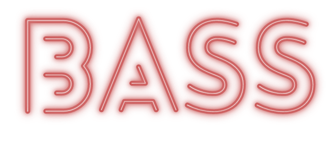

# Bass
 
 
 
 ## What is Bass about?
 
One of the most important perk that you should have is how to look things differently. See an object and not only what was designed for, see through it. Bass tries too represent this feeling. It's the conclusion of a process, of think differently when you want to rethink how can I use the MacBook in a different way.
 
 ## How does Bass achieve it?
 
 Bass turns the Macbook into a Bass (Yeah, be creative with names is hard). Just press the start button:
 
 
 
 Open your Macbook the wider you can. Don't broke it. Like this:
 
 
 
 And play it!
